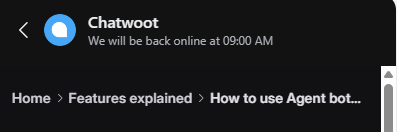
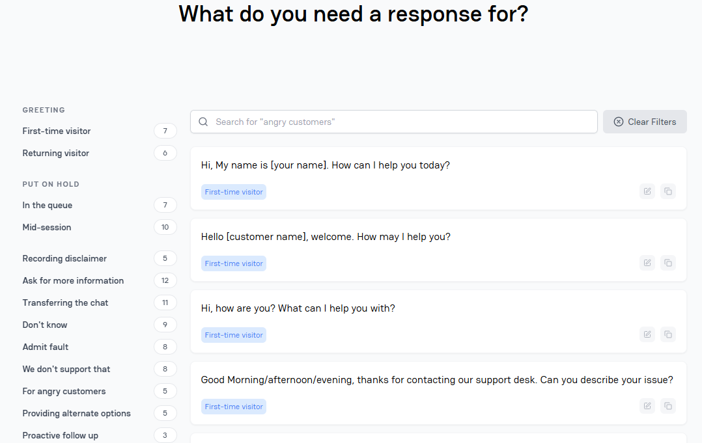

## Chatwoot Frontend Tech Stack

According to the Chatwoot developer documentation and related sources, the frontend uses:

* **Vue.js** framework (for the UI)
* **Vuex** for state management
* **Vue Router** for routing
* **Vue-i18n** for internationalization
* **Axios** for API communication (with request/response interceptors)
* **Vuelidate** for form validation
* Built and deployed using **webpack**, plus **Travis CI**, **S3**, and **CloudFront** for CI/CD, hosting, and distribution ([Medium](https://medium.com/hackernoon/zero-to-live-with-vue-how-we-built-chatwoot-c7304e596d62?utm_source=chatgpt.com), [HackerNoon](https://hackernoon.com/zero-to-live-with-vue-how-we-built-chatwoot-c7304e596d62?utm_source=chatgpt.com), [Chatwoot Developer Docs](https://developers.chatwoot.com/self-hosted/deployment/requirements?utm_source=chatgpt.com)).

---

## How Chatwoot Chatbot Can Benefit Your Organization

* **Centralized Omnichannel Support**
  Chatwoot unifies customer conversations across web chat, email, and messaging platforms like WhatsApp, Telegram, Twitter, etc., into a single interface ([GitHub](https://github.com/chatwoot/chatwoot?utm_source=chatgpt.com), [Chatwoot](https://www.chatwoot.com/?utm_source=chatgpt.com)).

* **AI Assistance with “Captain” & “Copilot”**
  Smart agents can automate replies, suggest answers, and translate customer inquiries—reducing agent workload and speeding up responses ([GitHub](https://github.com/chatwoot/chatwoot?utm_source=chatgpt.com), [Chatwoot](https://www.chatwoot.com/?utm_source=chatgpt.com)).

* **Self-Hosted & Data Ownership**
  As an open-source, self-hostable solution (built on Rails, PostgreSQL), Chatwoot gives you full control over your customer data—helpful for compliance and customization ([Chatwoot Developer Docs](https://developers.chatwoot.com/?utm_source=chatgpt.com), [Chatwoot](https://www.chatwoot.com/?utm_source=chatgpt.com)).

* **Extensible & Scalable**
  Chatwoot exposes rich APIs and supports integrations—ideal for tailoring support workflows to your organization's needs ([Chatwoot Developer Docs](https://developers.chatwoot.com/?utm_source=chatgpt.com), [Chatwoot](https://www.chatwoot.com/?utm_source=chatgpt.com)).

* **Built Help Center**
  Ships with a knowledge-base/FAQ module—reducing repetitive inquiries and supporting self-service ([GitHub](https://github.com/chatwoot/chatwoot?utm_source=chatgpt.com), [Chatwoot](https://www.chatwoot.com/?utm_source=chatgpt.com)).

---

### Chatwoot User Guide: Main Categories

1. **Chatwoot 101**

   * Intro to Chatwoot and customer engagement basics, including getting started with your first conversation and dashboard essentials.([Chatwoot](https://www.chatwoot.com/hc/user-guide/en))

2. **Setup Account**

   * Guides for account creation, profile customization, notifications, and general settings.([Chatwoot](https://www.chatwoot.com/hc/user-guide/en))

3. **Website Live Chat**

   * Documentation explaining live chat functionality and how to install it on platforms like Google Tag Manager, Webflow, Gatsby, and Docusaurus.([Chatwoot](https://www.chatwoot.com/hc/user-guide/en))

4. **Other Channels**

   * Instructions for integrating other communication channels, such as Facebook, Instagram (via Facebook Login), Twitter, WhatsApp, and SMS.([Chatwoot](https://www.chatwoot.com/hc/user-guide/en))

5. **Features Explained**

   * How to use labels, agent bots, manage contacts, canned response templates, and custom attributes.([Chatwoot](https://www.chatwoot.com/hc/user-guide/en))

6. **Advanced Features Explained**

   * Covers conversation filters, pre-chat forms, campaigns, interactive messages, and automation setup.([Chatwoot](https://www.chatwoot.com/hc/user-guide/en))

7. **Apps and Integrations**

   * Includes setups for Dialogflow chatbot integration, webhooks, Slack integration, dashboard apps, and Dyte video calls.([Chatwoot](https://www.chatwoot.com/hc/user-guide/en))

8. **Reports**

   * Guides to reading and understanding real-time overview reports, CSAT, conversation reports, bot performance, and SLA reports.([Chatwoot](https://www.chatwoot.com/hc/user-guide/en))

9. **Help Center**

   * Instructions for setting up and customizing a Help Center, including SSL setup for custom domains and embedding videos.([Chatwoot](https://www.chatwoot.com/hc/user-guide/en))

10. **Best Practices**

    * Recommended workflows like round-robin assignment, using the command bar, keyboard shortcuts, contact segmentation, and organizing chats with filters and folders.([Chatwoot](https://www.chatwoot.com/hc/user-guide/en))

11. **Other Topics**

    * Miscellaneous topics including cookie usage, mobile app documentation (Android/iOS), enterprise edition features, and supported languages.([Chatwoot](https://www.chatwoot.com/hc/user-guide/en))

12. **Migrations**

    * Guides for migrating from platforms such as Intercom, Front, Freshdesk, and Zendesk to Chatwoot.([Chatwoot](https://www.chatwoot.com/hc/user-guide/en))

13. **Captain (AI Agent)**

    * Documentation about the built-in AI assistant "Captain": its introduction, creating assistants and documents, FAQs, and managing "Captain Memories."([Chatwoot](https://www.chatwoot.com/hc/user-guide/en))

14. **How To**

    * Practical guides such as purchasing a self-hosted Chatwoot license.([Chatwoot](https://www.chatwoot.com/hc/user-guide/en))

---

## Preact-CLI Widget with Shadow DOM: What's Different?

| Feature/Aspect      | Chatwoot (Vue-based Frontend)            | Preact-CLI Widget in Shadow DOM                |
| ------------------- | ---------------------------------------- | ---------------------------------------------- |
| Framework           | Vue (with Vuex, Vue Router, Vue-i18n)    | Preact (React-like, minimal)                   |
| State & Routing     | Vuex, Vue Router                         | Typically simpler or no built-in routing       |
| Styling             | Global CSS via traditional pipeline      | Scoped via Shadow DOM; manual injection needed |
| Bundle Size         | Moderate—depends on Vue build            | Very small (\~3 kB), optimized for widgets     |
| Isolation           | Normal DOM, relies on naming conventions | Strong encapsulation via Shadow DOM            |
| Integration Context | Full web app or SPA                      | Embeddable widget across any host page         |

---

### RnD final thoughts

1. If your goal is an embeddable widget—for example, a lightweight chat interface—you might opt for a **Preact-based Shadow DOM widget** for fast, style-isolated integration.

2. But for comprehensive support capabilities at scale, **Chatwoot** offers a powerful, flexible, and privacy-respecting solution—complete with multi-channel support, AI assistance, and self-hosted deployment.

3. Want help integrating a Preact widget into Chatwoot or tailoring the Chatwoot widget to your brand? Feel free to ask!

4. "We will be back online at 9:00 am" showcasing active hours for convo

5. Loading skeleton in chat window

6. Tabbed navigation control at top

7. Canned Responses Library

8. Ctrl+K for exclusive searching through the web-app

9. Mild notification sounds with aria-live label

10. A chat-rating/feedback system

11. Chat widget Moments: it's a web page embedded in an iframe shown during a chat. <https://platform.text.com/docs/extending-chat-widget/chat-widget-moments>

---

### Alternatives

# Lit

### Why Lit Works Great for Embeddable Chat Widgets

* **Tiny footprint & blazing-fast updates**
  Lit is a lightweight (\~5 KB minified & gzipped) library that efficiently updates just the dynamic parts of the DOM, avoiding the overhead of virtual DOM diffing ([lit.dev](https://lit.dev/), [Medium](https://medium.com/%40yanguly/breaking-down-barriers-easy-web-components-with-lit-524fe70206b3?utm_source=chatgpt.com)).

* **Built on Web Components**
  Lit creates standards-compliant custom elements (Web Components), which are inherently **framework-agnostic** and easy to embed simply by using a custom HTML tag anywhere—even in non-standard or unknown host pages ([lit.dev](https://lit.dev/), [Product Engineering](https://waresix.engineering/creating-chat-widget-using-web-component-f2ffad8a9ebd?utm_source=chatgpt.com), [DEV Community](https://dev.to/reggi/framework-interoperable-component-libraries-using-lit-web-components-43ac?utm_source=chatgpt.com)).

* **Highly interoperable**
  Components authored in Lit can work seamlessly across frameworks (React, Angular, Vue, etc.) or with vanilla JS—great for broad adoption and reuse ([DEV Community](https://dev.to/reggi/framework-interoperable-component-libraries-using-lit-web-components-43ac?utm_source=chatgpt.com)).

---

#### How Lit Compares to Preact for Embeddable Widgets

| Feature                      | **Lit**                                                                                                                                                                                    | **Preact**                                                                                                                                                                                                                                                                                                 |
| ---------------------------- | ------------------------------------------------------------------------------------------------------------------------------------------------------------------------------------------ | ---------------------------------------------------------------------------------------------------------------------------------------------------------------------------------------------------------------------------------------------------------------------------------------------------------- |
| **Bundle Size**              | Very small (\~5 KB) ([lit.dev](https://lit.dev/), [Medium](https://medium.com/%40yanguly/breaking-down-barriers-easy-web-components-with-lit-524fe70206b3?utm_source=chatgpt.com))         | Small (\~3 KB) for core, but additional runtime may be needed ([Prerender](https://prerender.io/blog/best-javascript-frameworks-pros-cons-and-statistics/?utm_source=chatgpt.com), [Tag1 Consulting](https://www.tag1consulting.com/transcript-reducing-complexity-preact-and-htm?utm_source=chatgpt.com)) |
| **Rendering Strategy**       | Direct DOM updates, minimal boilerplate ([lucamezzalira.com](https://lucamezzalira.com/2018/08/14/a-night-experimenting-with-lit-html/?utm_source=chatgpt.com))                            | Virtual DOM diffing, similar to React                                                                                                                                                                                                                                                                      |
| **First Render Performance** | Slightly slower initial render, but blazing fast updates over time ([lucamezzalira.com](https://lucamezzalira.com/2018/08/14/a-night-experimenting-with-lit-html/?utm_source=chatgpt.com)) | Generally faster on first render, may lag updates over time                                                                                                                                                                                                                                                |
| **Interoperability**         | Full Web Components support—works anywhere                                                                                                                                                 | Requires compatibility wrapper or framework runtime                                                                                                                                                                                                                                                        |
| **Reactivity / Signals**     | Built-in reactive properties                                                                                                                                                               | Preact supports fast signals but typically requires extra setup ([Stack Overflow](https://stackoverflow.com/questions/77405932/comparing-performance-react-hooks-with-optimization-vs-preact-signals?utm_source=chatgpt.com))                                                                              |
